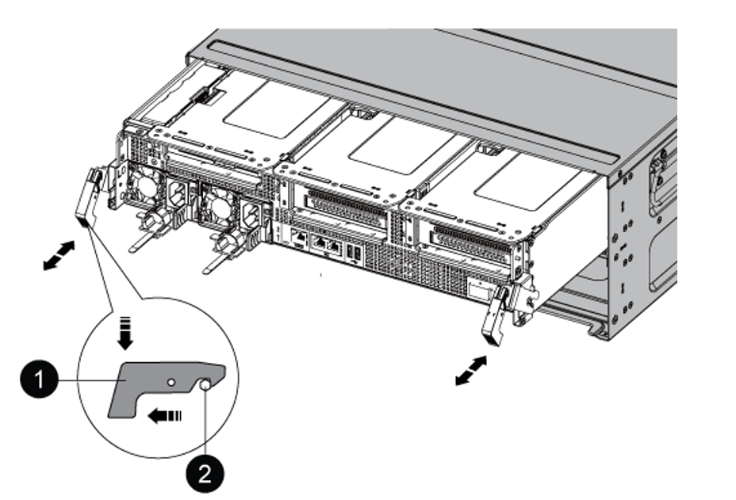

= 更换AFF A800控制器模块
:hardbreaks:
:allow-uri-read: 
:nofooter: 
:icons: font
:linkattrs: 
:imagesdir: ./media/

[role="lead"]
在此阶段， node1 已关闭，所有数据均由 node2 提供。由于 node1 和 node2 位于同一机箱中，并由同一组电源供电，因此请勿关闭机箱电源。您必须小心地仅卸下node1控制器模块。通常， node1 是控制器 A ，位于机箱左侧，用于从系统背面查看控制器。控制器标签位于机箱上，控制器模块正上方。

.开始之前
如果您尚未接地，请正确接地。

== 准备卸下AFF A800控制器模块

.步骤
. 在机箱正面、用拇指用力推入每个驱动器、直到您感觉到有一定的停机。这样可确保驱动器牢固地固定在机箱中板上。
+
image::../media/drw_a800_drive_seated_IEOPS-960.png[推动驱动器、使其紧紧靠在机箱中间板上]

. 转至机箱背面。

== 卸下 AFF A800 控制器模块

从AFF A800控制器模块中卸下缆线管理设备、然后将控制器稍微移出机箱。

.步骤
. 从电源拔下node1控制器模块的电源。
. Release the power cable retainers, and then unplug the cables from the power supplies.
. Loosen the hook and loop strap binding the cables to the cable management device, and then unplug the system cables and SFP and QSFP modules (if needed) from the controller module, keeping track of where the cables were connected.
+
Leave the cables in the cable management device so that when you reinstall the cable management device, the cables are organized.

. Remove the cable management device from the controller module and set it aside.
. Press down on both of the locking latches, and then rotate both latches downward at the same time.
+
The controller module moves slightly out of the chassis.

+

+
[cols="20,80"]
|===

 a| 
image::../media/black_circle_one.png[第一]
| Locking latch 

 a| 
image::../media/black_circle_two.png[第二]
| Locking pin 
|===

== 安装AFF A90或AFF A70控制器模块

在node1中安装AFF A90或AFF A70控制器模块并为其布线和连接。

.步骤
. Align the end of the controller module with the opening in the chassis, and then gently push the controller module halfway into the system.
+

NOTE: 请勿将控制器模块完全插入机箱，除非稍后在操作步骤 中指示您这样做。

+
image::../media/drw_A70-90_PCM_remove_replace_IEOPS-1365.PNG[安装AFF A90或AFF A70]

. 使用缆线将管理和控制台端口连接到 node1 控制器模块。
+

NOTE: 由于机箱已通电、因此、node1会在插入新控制器模块后立即启动BIOS初始化、然后自动启动。为避免这种自动启动、NetApp建议在插入控制器模块之前先连接串行电缆和控制台电缆。

. 在凸轮把手处于打开位置的情况下、用力推入控制器模块、直至其与中板接触并完全就位。控制器模块完全就位后，锁定闩锁会上升。将凸轮把手关闭至锁定位置。
+

NOTE: 为避免损坏连接器，请勿在将控制器模块滑入机箱时用力过大。

. 一旦模块就位，请立即连接串行控制台，并准备好中断 node1 的自动启动。
. 中断自动启动后、node1将停留在加载程序提示符处。
+
如果未按时中断自动启动、而node1开始启动、请等待提示符、然后按Ctrl-C进入启动菜单。在节点停留在启动菜单处后、使用option `8` 重新启动节点、并在重新启动期间中断自动启动。

. 在 LOADER 提示符 node1 处，设置默认环境变量：
+
`set-defaults`

. 保存默认环境变量设置：
+
`saveenv`

