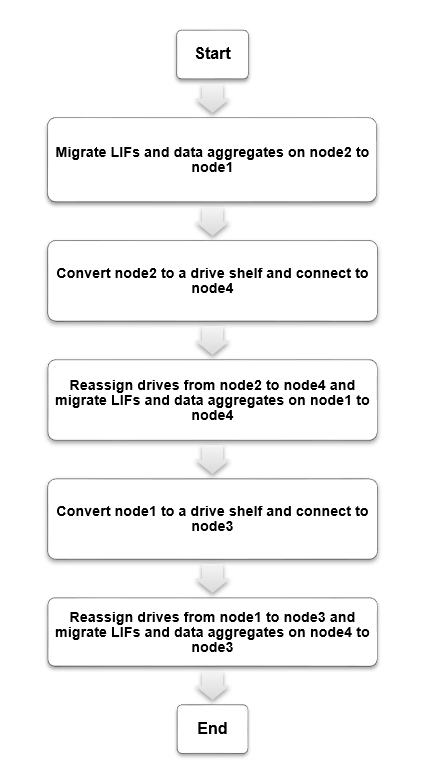

= 工作流
:allow-uri-read: 
:icons: font
:imagesdir: ../media/

[role="lead"]
您可以通过将每个AFF A250节点转换为NS224驱动器架、然后连接到AFF A400替代节点、从AFF A250系统无中断升级到AFF A400系统。

在此操作步骤 中、AFF A250高可用性(HA)对控制器称为node1和node2、替代AFF A400 HA对控制器称为node3和node4。

.步骤。
. xref:upgrade_migrate_lifs_aggregates_node2_to_node1.adoc[将node2上的生命周期管理器和数据聚合迁移到node1]
. xref:upgrade_convert_node2_drive_shelf_connect_node4.adoc[将node2转换为驱动器架并连接到node4]
. xref:upgrade_reassign_drives_node2_to_node4.adoc[将驱动器从node2重新分配给node4]
. xref:upgrade_migrate_aggregates_epsilon_lifs_node1_node4.adoc[将node1上的数据聚合、eps龙 和生命周期管理迁移到node4]
. xref:upgrade_convert_node1_drive_shelf_connect_node3.html[将node1转换为驱动器架并连接到node3]
. xref:upgrade_reassign_drives_node1_to_node3.adoc[将驱动器从node1重新分配给node3]
. xref:upgrade_migrate_lIFs_aggregates_node4_node3.adoc[将node4上的生命周期管理器和数据聚合迁移到node3]

