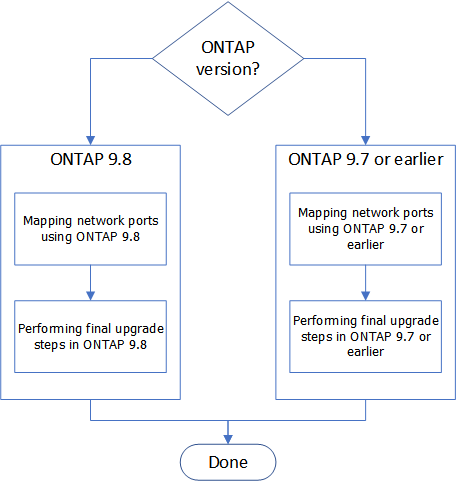

= 完成升级
:icons: font
:imagesdir: ../media/

[role="lead"]
在 ONTAP 9.8 ， ONTAP 9.7 或更早版本中完成升级。

您必须对您的 ONTAP 版本使用操作步骤。

* 要在 ONTAP 9.8 中完成升级，请转至 xref:upgrade-complete-ontap-9-8.adoc[在 ONTAP 9.8 中完成升级]。
* 要在 ONTAP 9.7 或更早版本中完成升级，请转至 xref:upgrade-complete-ontap-9-7-or-earlier.adoc[在 ONTAP 9.7 或更早版本中完成升级]。

