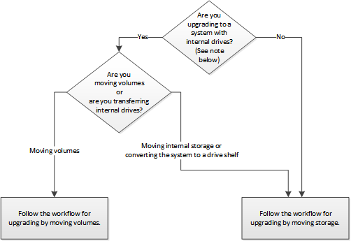

= 选择升级控制器硬件的方法
:allow-uri-read: 
:icons: font
:imagesdir: ../media/

[role="lead"]
通常，控制器硬件的升级方式取决于原始节点的平台型号。您可以通过移动存储（中断操作步骤）或移动卷（无中断操作步骤）来升级。

NOTE: 具有内部驱动器的型号包括：FAS2520、FAS2552、FAS2554、FAS2620、FAS2650、 FAS2720、FAS2750、AFF A150、AFF A200、AFF A220、 AFF A250、AFF A700s、AFF A800、AFF C190、AFF C250、 和AFF C800。

如果您的系统未在上面列出，请参见 https://hwu.netapp.com["NetApp Hardware Universe"^] 以检查它是否具有内部驱动器。

如果要从AFF A250升级到AFF A400、请参见 xref:upgrade_aff_a250_to_aff_a400_ndu_upgrade_workflow.adoc[通过转换为驱动器架将AFF A250升级到AFF A400]。

* 相关信息 *

link:upgrade-by-moving-storage-parent.html["通过移动存储进行升级的工作流"]

link:upgrade-by-moving-volumes-parent.html["通过移动卷进行升级的工作流"]
